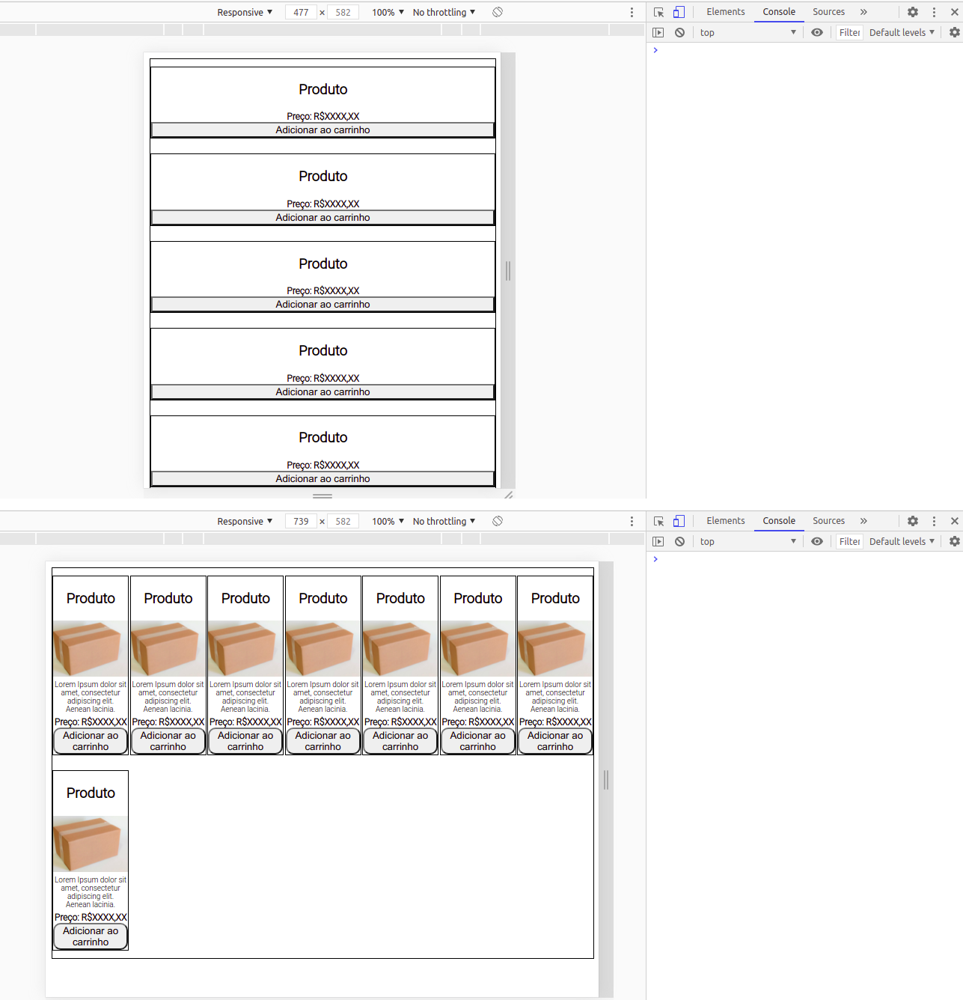

# CSS | Gama Academy | Hiring Coders 2

## Exercícios de CSS 

- [x] 01 - Introdução ao CSS
- [x] 02 - Tag Style
- [x] 03 - Tipos de Propriedades CSS
- [x] 04 - Propriedades: border, margin e padding
- [x] 05 - Propriedades: cores e tipografia
- [x] 06 - Introdução a Flexbox
- [x] 07 - Flexbox: align e justify
- [x] 08 - Flex-grow, flew-shrink e flex-basis
- [x] 09 - Seletores
- [x] 10 - Especificidade de Seletores CSS
- [x] 11 - Utilizando CSS no HTML
- [x] 12 - Media Queries
- [x] 13 - Prática de CSS
- [x] 14 - Prática: Flexbox
- [x] 15 - Prática: Media Query 

Screenshot do último exercício:

